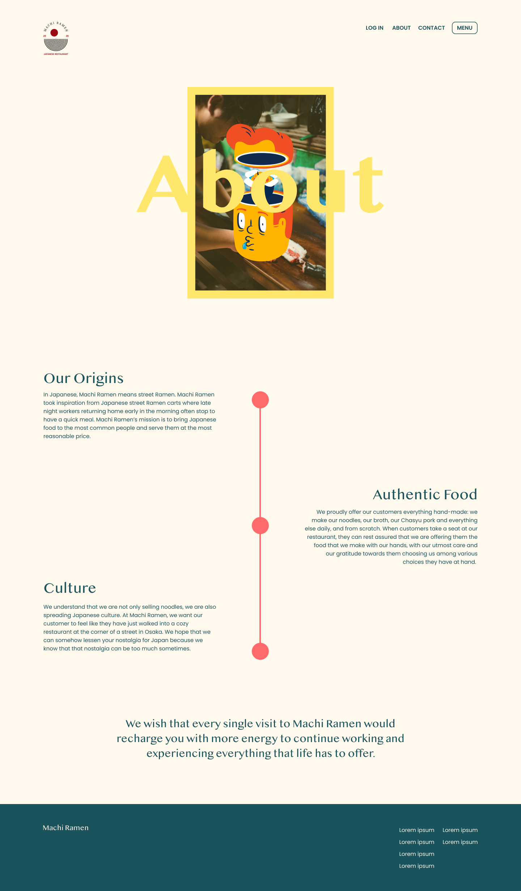
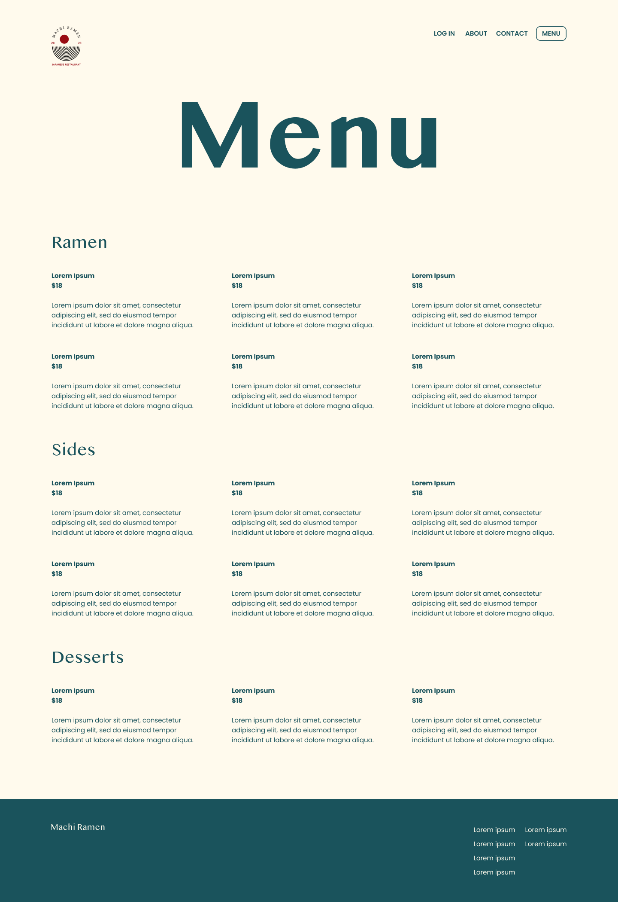
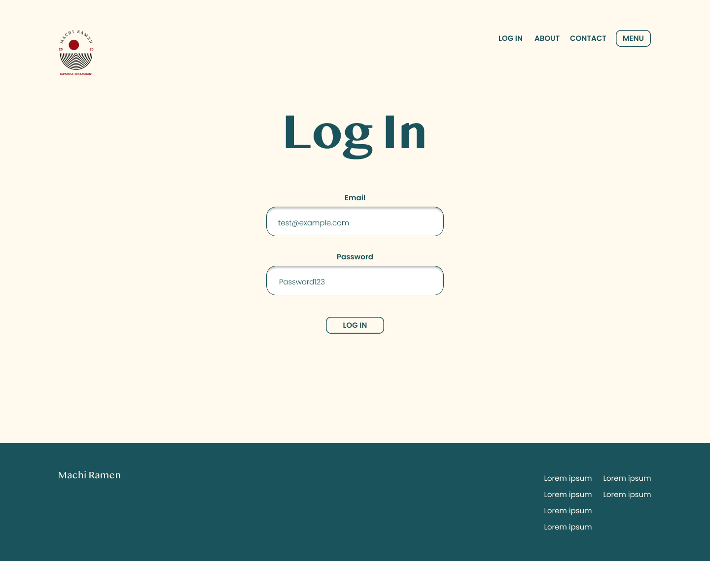

> # R1 Description of your website

# Purpose
Machi Ramen is a small family-run Japanese restaurant in the heart of Ultimo. The restaurant’s main source of income is from university students in the area as well as a small percentage of the local Japanese community. Machi Ramen wants to expand its brand exposure to a wider demographic of customers. Based on a survey conducted by the restaurant they were able to determine what the customers were looking for in their rebranding. The main topics were being able to learn about the family origins, the stories behind the dishes and how the restaurant sources its produce. Machi Ramen wants a web application that can present these topics in a beautiful graphical user interface while creating a brand that customers come to know and love. 

# Functionality / features

## MVP version

- Home Page

The home page is the first page users see when entering the site. This landing page needs to follow traditional design affordances such as a navbar containing a list of buttons for relevant pages. The home page will contain a large graphical header with the store name and a brief description about the restaurant. At the top of the page, there will be a login and signup bar where users can register themselves in the database. This feature is part of a possible further extension to be added where users can create bookings and order directly through the website. 

- Menu Page 

The menu page will be layed out in a  card formation with information about each individual dish, i.e. name, price and description. The users can click on each individual dish to reveal a more detailed description as well as the ingredients.

- About Page 

The about page acts as a platform for Machi Ramen to tell customers about their family origins, the store’s history and what inspires their dishes. The about page is purely textual with a few images and stunning graphics. There is no requirement on this page for further functionality as this will draw away from its sole purpose.

- Contact Page 

The contact page features Machi Ramen’s phone number, email and address. A possible extension of this page is to add a contact form so customers can leave reviews and any constructive criticism they may have for the restaurant. This form will be directly linked to Machi Ramen’s email address. 

- Authentication and Authorization 

The website will feature sign-up, sign-in and sign-out functionality. At the first stage of development, this feature will be used to grant administrative rights to the owner of the restaurant. They will be able to perform CRUD functionality on the site, posting new dishes, updating existing dishes, and deleting items that are no longer on the menu. This CRUD functionally has the possibility to be extended into more aspects of the website as the application continues to develop. 

## Possible Extensions 

- Bookings

Ideally the web application will feature a booking system where users can pre-book a table without having to call Machi Ramen directly. This system will greatly increase Machi Ramen’s productivity and provide them with a succinct way to keep track of bookings. The booking system will feature an interactive display of available times, a form for users to enter their name, email, phone number and booking size. Users would also need to be able to cancel their bookings with ease should their plans change. 

- Blog

To build a following of passionate Machi Ramen customers it is essential for the restaurant to be consistent in social media and blog posts. An extension of the web application will be a blog page so users can keep up to date with the restaurant's developments. This page is a great place to build culture and for the media to share articles, in turn attracting a larger customer base. The page will consist of large cards where users can click on each to reveal the full story. 

- Social Media Channels 

Similar to maintaining a blog Machi Ramen must have elegant social media channels to connect with a greater customer demographic. Although these are not directly part of the web application, a feed with latest Instagram posts at the bottom of the home page would be a nice addition to the site. This feed will be presented in a small card layout with links to their third-party social media accounts e.g. Instagram, Facebook and Twitter. 

- Map Location 

An addition to the contact page would be a Google Maps integration so users can see where the shop is located in relevance to its surroundings. This interactive feature is not essential however is adding another level of depth to the website. 

- Online Ordering & Shopping Cart 

Machi Ramen loses 30-35% of their profits when selling food through third-party delivery services. A solution to this problem would be for customers to order directly through the Machi Ramen website and have the restaurant supply their own delivery drivers. The logistics behind this process would need to be fully defined before this is implemented; however, establishing an ordering system would be a great first way for the restaurant to test its success. Like any online shopping process, the customers would select their dishes which would be then added to their shopping cart, leave any comments in a form for the restaurant and pay online through a third-party service such as Stripe. 

# Target audience

- Students in Ultimo area
- Workers in Ultimo area
- Local residence in Sydney city
- Japanese food lovers
- Visitors from greater Sydney 
- Tourists

# Tech stack

- Application:
    - Backend API: Ruby on Rails
    - Frontend: JavaScript, ReactJS
- Database:
    - PostgreSQL
- Deployment server:
    - Backend API: Heroku
    - Frontend: Netlify
- CSS Framework:
    - Tailwind
- Image cloud storage:
    - Amazon Web Services
- Version Control:
    - Git
    - Github
- Project Management: 
    - Trello
- Tool to draw wireframes:
    - Figma

# Sitemap
MVP version

Possible extensions

> # R2	Dataflow Diagram

## Dataflow Diagram of the MVP

## Dataflow Diagram of the extensions

> # R3	Application Architecture Diagram

> # R4 User Stories

## The MVP version

- Customer

    - As a customer, I want to view all items on the menu with a detailed description, price and so I can make a proper decision as to what I want to eat. 
    - As a customer, I want to be able to understand what ingredients go into each individual dish so I can avoid conflicts with my allergies. 
    - As a customer, I want to be able to understand what type of cuisine the food falls under so I can decide if this is the right restaurant for me.
    - As a customer, I want to be able to learn about Machi Ramen so I can understand the origins of the store and how authentic the meals are. 
    - As a customer, I want to be able to contact Machi Ramen via phone number and email to order food or book a reservation.
    - As a customer, I want to be able to understand where Machi Ramen is based so I can determine if this store is within my local area. 

- Administrator 

    - As an administrator I want to be able to log in and sign out of the Machi Ramen website so I can perform administrative tasks.
    - As an administrator, I want to be able to add, update, view and delete dishes items on the website so I can keep the menu relevant for customers.

## Possible Extensions 

- Customer
    - As a customer, I want to see images of dishes so I can know how they look like
    - As a customer I want to be able to create an account on the Machi Ramen website so I can validate my booking and online orders. 
    - As a customer, I want to be able to create a booking directly through Machi Ramen’s website so I can reserve a table for when I arrive at the restaurant.
    - As a customer, I want to be able to update or cancel this booking so I can inform Machi Ramen of my plans.
    - As a customer, I want to be able to get in contact with the restaurant directly through a built-in form function so I can leave the owner appraisal or constructive criticism.
    - As a customer, I want to be able to view Machi Ramen’s latest social media posts so I can understand the culture of the restaurant and the type of food they produce.
    - As a customer, I want to be able to view Machi Ramen’s social media account through accessible links so I can understand the culture of the restaurant and the type of food they produce.
    - As a customer, I want to be able to view the restaurant's location on a 2D interactive map so I can determine how close it is to my location and its relevant surroundings. 
    - As a customer, I want to be able to order items directly through the website in a secure system so I don't have to leave my house, to know my payment details are safe and to avoid having to call the restaurant.
    - As a customer, I want to be able to view all blog posts to understand the stories behind the dishes and the culture of the restaurant.

- Administrator
    - As an administrator, I want to be able to view all customer bookings so I can prepare tables according to booking sizes. 
    - As an administrator, I want to be able to contact the owner of the booking to confirm or let them know of changes to their booking. 
    - As an administrator, I want to be able to post, update and delete blog posts so I can keep the website relevant and edit changes that need to be made.
    - As an administrator, I want to be able to view all online orders and requests made by the customer so I can prepare the food and arrange a delivery driver. 
    - As an administrator, I want to be able to contact online buyers to let them know of any changes to the menu or their orders.
    - As an administrator, I want to be able to see all reviews made on the review form so I can continue to improve the website.
    - As an administrator, I want to be able to delete reviews that don’t meet suitable guidelines and leave a comment on customer reviews to build a connection.

> # R5 Wireframes

> # R6 Screenshots of your Trello board throughout the duration of the project
- Day 1: Discuss ideas and divide tasks. For Part A, the tasks are quite straight-forward so we use first 5 lists: 
    - Requirement-PartA: All requirements of Part A and rubic criteria, marking instruction in each card.
    - To do: task to do in Part A
    - Design & Research: Design ideas and what we need to learn or do research on
    - Doing: which tasks are in progress
    - Done: tasks are done

- Day 3: 10.07.2021
When creating cards, we try to assign member in charge and put a deadline if possible to follow easily. We agreed that we have a meeting everyday as a daily scrum meeting to keep track of the process.

- Day 4: 11.07.2021

- Day 5: 12.07.2021
We have done most of part A, just some diagrams need to be fixed. We created initial repository on GitHub, forking repository and started with coding part B. Coding tasks are put in cards with assigned member and deadline(if possible)

- Day 6: 13.07.2021
All of the tasks for assignment part A haved been done, so we moved on to focus on coding in part B.

